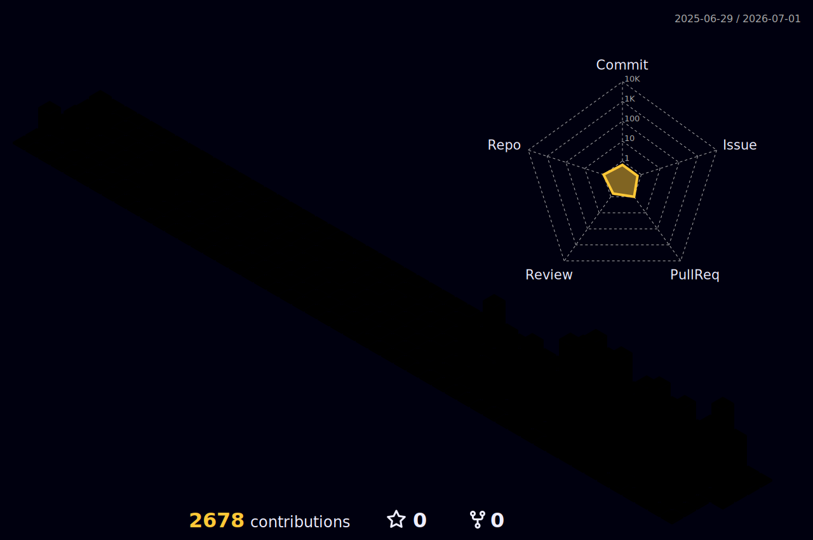

  

 

  <picture>
    <source media="(prefers-color-scheme: dark)" srcset="https://skillicons.dev/icons?i=php,laravel,ts,js,go,python,dart,flutter,html,css,terraform,docker,aws,git,github&theme=dark" />
    <source media="(prefers-color-scheme: light)" srcset="https://skillicons.dev/icons?i=php,laravel,ts,js,go,python,dart,flutter,html,css,terraform,docker,aws,git,github&theme=light" />
    
  </picture>

 

<table align="center" border="0" cellpadding="0" cellspacing="0">
  <tr>
    <td width="50%" align="center">
      <picture>
        <source media="(prefers-color-scheme: dark)" srcset="output/metrics.base.svg" />
        <source media="(prefers-color-scheme: light)" srcset="output/metrics.base.svg" />
        
      </picture>
    </td>
    <td width="50%" align="center">
      <picture>
        <source media="(prefers-color-scheme: dark)" srcset="https://streak-stats.demolab.com/?user=Wadakai-97&theme=tokyonight&hide_border=true&background=0d1117&stroke=6E9EF7&ring=6E9EF7&fire=FF6B35&currStreakLabel=6E9EF7" />
        <source media="(prefers-color-scheme: light)" srcset="https://streak-stats.demolab.com/?user=Wadakai-97&theme=default&hide_border=true" />
        
      </picture>
    </td>
  </tr>
</table>

 

  <picture>
    <source media="(prefers-color-scheme: dark)" srcset="profile-3d-contrib/profile-night-rainbow.svg" />
    <source media="(prefers-color-scheme: light)" srcset="profile-3d-contrib/profile-season-animate.svg" />
    
  </picture>

 

<table align="center" border="0" cellpadding="0" cellspacing="0">
  <tr>
    <td width="50%" align="center">
      <picture>
        <source media="(prefers-color-scheme: dark)" srcset="output/details.svg" />
        <source media="(prefers-color-scheme: light)" srcset="output/details.svg" />
        
      </picture>
    </td>
    <td width="50%" align="center">
      <picture>
        <source media="(prefers-color-scheme: dark)" srcset="output/metrics.plugin.achievements.compact.svg" />
        <source media="(prefers-color-scheme: light)" srcset="output/metrics.plugin.achievements.compact.svg" />
        
      </picture>
    </td>
  </tr>
</table>

 

  <picture>
    <source media="(prefers-color-scheme: dark)" srcset="https://github-readme-activity-graph.vercel.app/graph?username=Wadakai-97&theme=tokyo-night&hide_border=true&bg_color=0d1117&color=6E9EF7&line=A855F7&point=FF6B35&area=true&area_color=6E9EF7" />
    <source media="(prefers-color-scheme: light)" srcset="https://github-readme-activity-graph.vercel.app/graph?username=Wadakai-97&theme=minimal&hide_border=true&area=true" />
    
  </picture>

